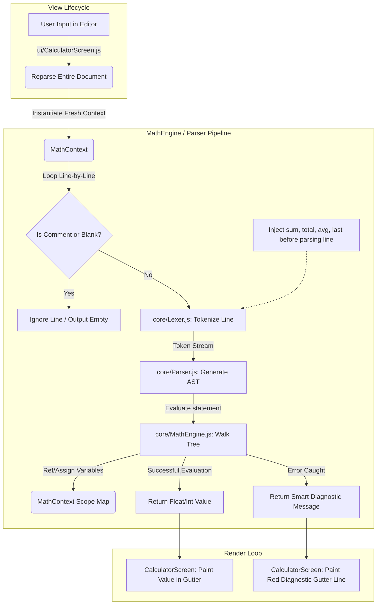

# NoteCalci Web 🧮

A highly offline, text-editor-style document calculator for the web. 

**NoteCalci Web** is a custom offline-first browser-based notepad calculator port, inspired by and structurally modeled after the open-source native Android power-user calculator [NerdCalci by Vishal Telangre](https://github.com/vishaltelangre/NerdCalci). NoteCalci Web ports NerdCalci's core mathematical engine boundaries to a modular vanilla ES6 JavaScript implementation designed for web browser viewports.

---

## 📁 Web-to-Upstream File Mapping

To ensure ease of porting new calculation features from [NerdCalci](https://github.com/vishaltelangre/NerdCalci) and structural maintenance, NoteCalci Web preserves precise components separation matching the upstream Kotlin source hierarchy at the latest release tag [v4.6.0](https://github.com/vishaltelangre/NerdCalci/releases/tag/v4.6.0):

| Web Component File | Upstream NerdCalci Tag v4.6.0 Permanent Reference | Functional Purpose |
| :--- | :--- | :--- |
| **`core/Lexer.js`** | [core/Lexer.kt](https://github.com/vishaltelangre/NerdCalci/blob/v4.6.0/app/src/main/java/com/vishaltelangre/nerdcalci/core/Lexer.kt) | Scans line text inputs and generates standard syntactic tokens under the `NoteCalci` namespace. |
| **`core/Parser.js`** | [core/Parser.kt](https://github.com/vishaltelangre/NerdCalci/blob/v4.6.0/app/src/main/java/com/vishaltelangre/nerdcalci/core/Parser.kt) | Performs grammar analysis using Recursive Descent parsing, respecting Operator Precedence (BODMAS). |
| **`core/MathEngine.js`**| [core/MathEngine.kt](https://github.com/vishaltelangre/NerdCalci/blob/v4.6.0/app/src/main/java/com/vishaltelangre/nerdcalci/core/MathEngine.kt) & [Evaluator.kt](https://github.com/vishaltelangre/NerdCalci/blob/v4.6.0/app/src/main/java/com/vishaltelangre/nerdcalci/core/Evaluator.kt) | Manages document-wide evaluation flow, memory scopes, dynamic block variables, and decimal formatting. |
| **`ui/CalculatorScreen.js`**| [ui/HomeScreen.kt](https://github.com/vishaltelangre/NerdCalci/blob/v4.6.0/app/src/main/java/com/vishaltelangre/nerdcalci/ui/home/HomeScreen.kt) | Coordinates the DOM viewports, splits scroll synchronizations, and updates results gutters. |
| **`index.html`** | Android UI layout XML resources | Host index file loaded sequentially in browsers via standard `<script>` tags. |
| **`style.css`** | Compose XML themes & typography grids | Establishes precise pixel-level line structures and developer dark color presets. |

---

## ⚙️ System Architecture & Workflow

NoteCalci Web employs an offline execution pipeline that parses the document line-by-line on every keystroke, matching the operational stages of NerdCalci.

### Execution Pipeline Steps:
1. **Keystroke Listeners:** `ui/CalculatorScreen.js` captures changes inside the editor, keeping text line heights and scrolling behavior synchronized with a separate side-gutter pane.
2. **Execution Reset:** At the start of every document calculation pass, `MathEngine` clears all variable states to ensure sequential expression parsing.
3. **Lexing (Lexer.js):** Raw lines of text (minus comments trailing after `#`) are tokenized into objects indicating values and structural types (`NUMBER`, `IDENTIFIER`, operators, or grouping `(,)`).
4. **Parsing (Parser.js):** Iterates over the token stream using mathematical grammar rules to isolate components hierarchically:
    - **Factors:** Numbers, parenthesized groups, or inline function calls (`sqrt()`, `sin()`).
    - **Exponents:** Power operations (`^`).
    - **Terms:** High-precedence multiplication, division, and modulo (`*`, `/`, `%`).
    - **Expressions:** Low-precedence sums and differences (`+`, `-`).
    - **Assignments:** Variable bindings mapped via the `=` token, saving state inside the `MathContext` registry.
5. **Diagnostic Rendering:** The UI paints the successful results aligned with each editor line, or isolates syntax errors with structured messages (e.g. `Error: Variable "x" is not defined`).

---

## 📜 Attribution & Licensing

NoteCalci Web is a web port inspired by [NerdCalci](https://github.com/vishaltelangre/NerdCalci). Credit goes to **Vishal Telangre** and all contributors of the original open-source NerdCalci project. In alignment with the original project, this port is shared under the terms of the **GNU General Public License v3.0 (GPL-3.0)**.
