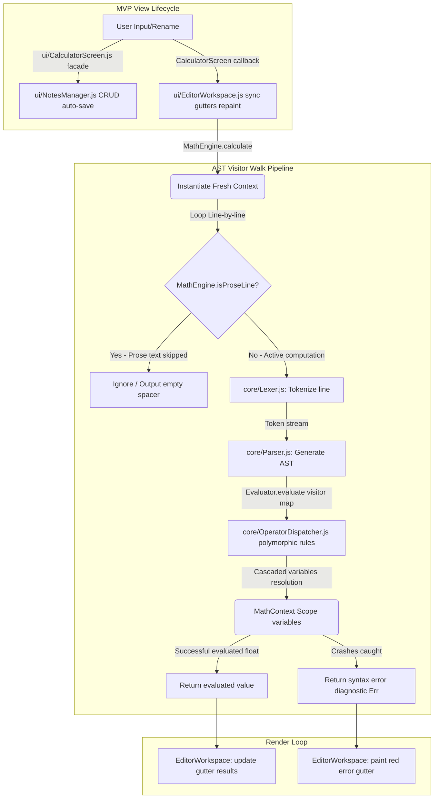

# NoteCalci Web 🧮

A highly offline, text-editor-style document calculator for the web. 

**NoteCalci Web** is a custom offline-first browser-based notepad calculator port, inspired by and structurally modeled after the open-source native Android power-user calculator [NerdCalci by Vishal Telangre](https://github.com/vishaltelangre/NerdCalci). NoteCalci Web ports NerdCalci's core mathematical engine boundaries to a modular vanilla ES6 JavaScript implementation designed for web browser viewports.

---

## 📁 Web-to-Upstream File Mapping

To ensure ease of porting new calculation features from [NerdCalci](https://github.com/vishaltelangre/NerdCalci) and structural maintenance, NoteCalci Web preserves precise components separation matching the upstream Kotlin source hierarchy at the latest release tag [v4.6.0](https://github.com/vishaltelangre/NerdCalci/releases/tag/v4.6.0):

| Web Component File | Upstream NerdCalci Tag v4.6.0 Permanent Reference | Functional Purpose |
| :--- | :--- | :--- |
| **`core/Lexer.js`** | [core/Lexer.kt](https://github.com/vishaltelangre/NerdCalci/blob/v4.6.0/app/src/main/java/com/vishaltelangre/nerdcalci/core/Lexer.kt) | Scans line text inputs and generates standard syntactic tokens under the `NoteCalci` namespace. |
| **`core/Parser.js`** | [core/Parser.kt](https://github.com/vishaltelangre/NerdCalci/blob/v4.6.0/app/src/main/java/com/vishaltelangre/nerdcalci/core/Parser.kt) | Performs grammar analysis using Recursive Descent parsing, respecting Operator Precedence (BODMAS). |
| **`core/OperatorDispatcher.js`**| N/A (Web Extensibility layer) | Polymorphic algebra dispatcher resolving standard and custom unit or date operations (`+`, `-`, `*`, `/`). |
| **`core/MathEngine.js`**| [core/MathEngine.kt](https://github.com/vishaltelangre/NerdCalci/blob/v4.6.0/app/src/main/java/com/vishaltelangre/nerdcalci/core/MathEngine.kt) & [Evaluator.kt](https://github.com/vishaltelangre/NerdCalci/blob/v4.6.0/app/src/main/java/com/vishaltelangre/nerdcalci/core/Evaluator.kt) | Manages document-wide evaluation flow, memory scopes, and dynamic AST Visitor walk loop. |
| **`ui/NotesManager.js`** | N/A (Web LocalStorage layer) | Persistent workbook documents CRUD manager utilizing HTML5 LocalStorage. |
| **`ui/NotesSidebar.js`** | Android sidebar navigation layouts | Component handling Note sidebar catalogs visual index lists, searches, and creations. |
| **`ui/EditorWorkspace.js`**| Android layout gutters Compose templates | Component managing synced editor scroll coordinate locks, row overlays highlights, and line numbers. |
| **`ui/CalculatorScreen.js`**| [ui/HomeScreen.kt](https://github.com/vishaltelangre/NerdCalci/blob/v4.6.0/app/src/main/java/com/vishaltelangre/nerdcalci/ui/home/HomeScreen.kt) | Clean Facade Controller orchestrating notes catalogs, synced layouts, and calculators calculations. |
| **`index.html`** | Android UI layout XML resources | Host index file loaded sequentially in browsers via standard `<script>` tags. |
| **`style.css`** | Compose XML themes & typography grids | Establishes precise pixel-level line structures, sidebars index lists, and About tabs. |

---

## ⚙️ System Architecture & Workflow

NoteCalci Web employs an offline execution pipeline that parses the document line-by-line on every keystroke, matching the operational stages of NerdCalci.

### Execution Pipeline Steps:
1. **MVP View Lifecycles:** `ui/CalculatorScreen.js` coordinates user keystroke adjustments, driving title renames into `NotesManager` auto-save layers and routing scroll wheel heights synchronously inside `EditorWorkspace`.
2. **Grammar Sandboxing (isProseLine):** Plain English sentences, URLs, Markdown headers, and dividers containing unregistered words are filtered out to prevent parser exceptions.
3. **Lexing (Lexer.js):** Active arithmetic equations are scanned, tokenizing brackets, variables, floats, and identifiers.
4. **AST Parsing (Parser.js):** Generates hierarchical syntax nodes (`Expr.Binary`, `Expr.FunctionCall`) based on recursive operator precedence rules.
5. **Visitor walkers (MathEngine.js & OperatorDispatcher.js):** Walks the AST using modular visitor callbacks mapped dynamically to `OperatorDispatcher` polymorphic type handlers.
6. **Gutter Repaint:** Results list is loaded into the side pane side-by-side, and the background overlay paints horizontal underlines aligned with equations.

---

## 📜 Attribution & Licensing

NoteCalci Web is a web compiler port inspired by and modeled after the native [NerdCalci by Vishal Telangre](https://github.com/vishaltelangre/NerdCalci).

In addition, several prominent user-interface layouts (such as the dynamic horizontal highlights underlines backgrounds overlays, multi-sheet LocalStorage document workspaces list navigator sidebars, and frameless dynamic title renamer input bars) are inspired by and adapted from the excellent work of **Steve Ridout** on [Notepad Calculator](https://github.com/SteveRidout/notepad-calculator). We extend our deepest gratitude for his excellent open-source contributions.

In alignment with both baseline projects, this web workbook utility is shared under the terms of the **GNU General Public License v3.0 (GPL-3.0)**.

